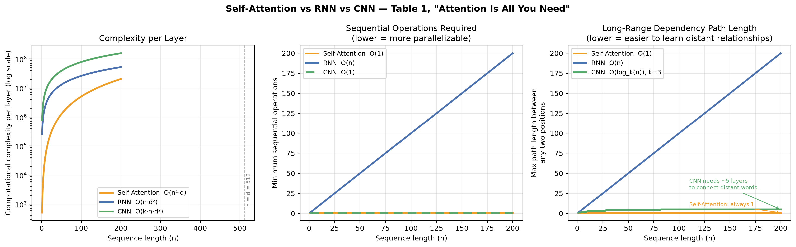

# Attention Is All You Need

Vaswani et al., 2017. [`attention_is_all_you_need.py`](attention_is_all_you_need.py)

Section 3.2 only: scaled dot-product attention and the multi-head version built
on top of it.

Written in NumPy — no autograd, no training loop, nothing that hides the math.

```
Attention(Q, K, V) = softmax(QK^T / sqrt(d_k)) V
```

The whole thing is about a hundred lines. `scaled_dot_product_attention` is the
five steps in order — score, scale, mask, softmax, weighted sum — and
`MultiHeadAttention` projects the input, splits it into heads, runs each head
through those five steps, and concatenates the results back.

Run it:

```bash
python attention_is_all_you_need.py
```

It builds a six-token toy sentence ("The cat sat on the mat"), pushes random
vectors through two heads, and prints the attention weights twice — once
unmasked, once with a causal mask.

The masked run is the interesting one:

```
[[1.   0.   0.   0.   0.   0.  ]
 [0.59 0.41 0.   0.   0.   0.  ]
 [0.24 0.48 0.28 0.   0.   0.  ]
 [0.23 0.3  0.2  0.27 0.   0.  ]
 [0.17 0.11 0.24 0.14 0.34 0.  ]
 [0.17 0.24 0.15 0.2  0.11 0.13]]
```

Row `i` is what token `i` attends to. Row 0 has nowhere to look but itself, so
it gets 1.0. Every row still sums to 1 — the mask goes in *before* the softmax
(as `-1e9`, which exponentiates to roughly zero), not after, which is the detail
that's easy to get backwards. The last row matches the unmasked run exactly,
since the final token can already see everything.

The weights are random, so nothing linguistic is happening. The shapes and the
zeros are the point.

## Why bother — Table 1

Section 4 argues for self-attention on three axes at once, which is easier to
see plotted than tabulated. [`plottings.py`](plottings.py) redraws Table 1 for
`d = 512`, `k = 3`, sequence lengths up to 200:



The middle and right panels are the whole argument. An RNN needs `O(n)`
sequential steps and `O(n)` hops to connect the first token to the last;
self-attention needs one of each, at the cost of the `O(n²·d)` term on the left.
That trade is only favourable while `n` stays under `d` — the reason every
long-context paper since has been about clawing back that `n²`.

## What's deliberately missing

No positional encoding, no feed-forward sublayer, no residuals or layer norm, no
encoder-decoder cross-attention, and no backward pass. The mask is also assumed
to be shared across heads, which is fine for causal masking but wouldn't hold if
you added per-sequence padding masks. Batching isn't there either — inputs are
`(seq_len, d_model)`, one sequence at a time.

All of that is real, and all of it obscures the part I wanted to look at.

## Setup

NumPy for the implementation, matplotlib for the plots.

```bash
python3 -m venv venv
source venv/bin/activate
pip install numpy matplotlib
```
